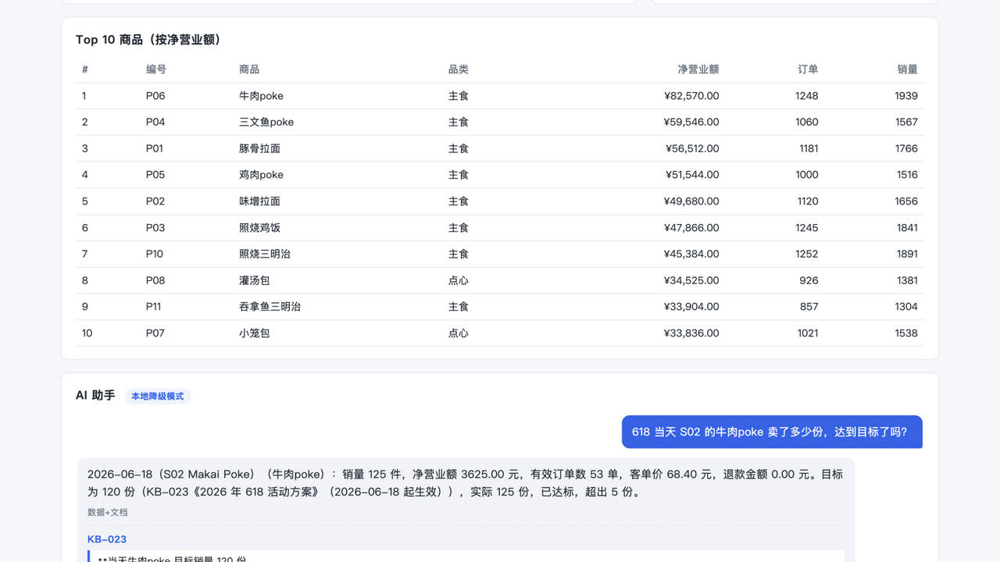

# DEMO —— 3 分钟验收脚本

这份演示覆盖一道混合问题的完整链路：自然语言提问 → 数据库查询 → 文档检索 →
带证据回答 → trace 定位。无需配置大模型 Key，降级模式也能完整演示。

## 0:00–0:30 启动与首页

在仓库根目录执行：

```bash
cd starter
make rebuild
make run
```

打开 `http://localhost:8000`。先指出页头的业务基准日固定为 `2026-09-01`，然后展示：

- 日期、门店和商品筛选；
- 净营业额、退款、订单、客单价和销量；
- 营业额趋势、环比、Top 10 和数据质量；
- 运营预警中的营业中断、环比骤跌和退款集中。

## 0:30–1:30 演示混合问答

在 AI 助手输入：

> 618 当天 S02 的牛肉poke 卖了多少份，达到目标了吗？

期望回答应明确包含：

- 数据库实际销量 `125` 份；
- 活动目标 `120` 份；
- 已达标，超出 `5` 份；
- `data_evidence` 中的查询条件为 `2026-06-18`、`S02`、`P06`；
- `citations` 引用 `KB-023`，quote 是知识库原文里的连续文字。

回答示例：



点击“数据证据”，核对数据库参数和结果。点击 `KB-023` 引用，核对“当天牛肉poke
目标销量 120 份”确实来自原文。经营数字由代码从只读数据库渲染，模型不能自行改写；
文档事实必须通过逐字 quote 核验。

## 1:30–2:30 演示可调试链路

在回答下方展开 trace，依次展示：

1. 问题规划：识别出 hybrid、日期、门店、商品和销量指标；
2. 数据库工具：`query_metrics` 的完整参数、结果和耗时；
3. 检索：每个片段的 `doc_id`、`chunk_id`、分数，以及被过滤文档的原因；
4. 本地作答：如何把已验证的数据和引用组成最终回答；
5. live 模式下还会显示完整模型请求与原始响应，思考内容不会进入用户答案。

如果要演示多轮，再追问：

> 那 7 月呢？

系统会继承同一个 `session_id` 的商品和门店上下文；换一个 `session_id` 不会串线。

## 2:30–3:00 演示运营闭环

回到顶部，在“S03 2026-06-08 营业中断”旁点击“问 AI 为什么”。系统会自动生成问题，
回答当天营业额为 0、给出上一日对照，并引用 `KB-020` 的停业整改通知。这个流程把
“发现异常 → 查询数字 → 找到原因 → 核对出处”放在同一个页面完成。

## 验收锚点

```bash
cd starter && make test
cd ..
python3 eval/run_eval.py --base-url http://localhost:8000 \
  --questions eval/public_questions.jsonl
python3 eval/run_eval.py --base-url http://localhost:8000 \
  --questions eval/my_questions.jsonl --out report_my
```

当前结果：单元测试 `116 passed`；公开题库 `100/100`；自命题题库 `18/18`；
OpenAI 兼容接入预检 `14/14`。
